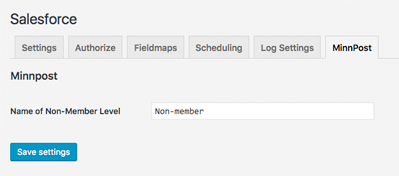

# Adding settings

Developers can extend the settings interface for this plugin in a couple of ways. This allows you to, for example, add another tab in addition to the defaults: Settings, Authorize, Fieldmaps, Scheduling, and Log Settings.

## Add a settings tab

Use the `object_sync_for_salesforce_settings_tabs` hook to add a tab to the Salesforce settings.

### Visual example

At MinnPost, we have a plugin that extends this plugin in several ways. Most of them are not visible in the interface, but one that is allows us to tell the plugin the name of a non-member (a user who does not donate). This is tied to various permission activities on the site.

We have a settings panel that tells the plugin what this user is called, and we add a tab to do it. This allows the setting to belong with the other Salesforce settings on which it depends.



Within this plugin, we can add any additional settings (or functionality) without affecting the Salesforce plugin's codebase.

### Code example

The code takes two steps: one to add the tab, and one to populate it. The hook receives the `$tabs` array as its only parameter.

#### Hook

```php
add_filter( 'object_sync_for_salesforce_settings_tabs', 'minnpost_tabs', 10, 1 );
function minnpost_tabs( $tabs ) {
    $tabs['minnpost'] = 'MinnPost';
    return $tabs;
}
```

Populating the settings tab is unrelated to this plugin, so you can do it with the default WordPress Settings API, or with any other supported method.

#### Settings API

```php
add_action( 'admin_init', 'minnpost_salesforce_settings_forms' );
function minnpost_salesforce_settings_forms() {
    $page = isset( $_GET['tab'] ) ? $_GET['tab'] : 'settings';
    $section = isset( $_GET['tab'] ) ? $_GET['tab'] : 'settings';
    $input_callback_default = 'display_input_field';
    $input_checkboxes_default = 'display_checkboxes';
    fields_minnpost_settings(
        'minnpost',
        'minnpost',
        array(
            'text' => $input_callback_default,
            'checkboxes' => $input_checkboxes_default
        )
    );
}
```

This `minnpost_salesforce_settings_forms` method is only part of our Settings API implementation. The rest is beyond the scope of this plugin, but the entire plugin [is viewable in our GitHub](https://github.com/MinnPost/minnpost-wordpress-salesforce-plugin).

## Modify existing settings tabs

This plugin also contains hooks for modifying the existing settings tabs for the plugin:

1. Change or disable the template that is loaded for any/all of the settings tabs.
2. Add content above or below the default content, on any/all of the settings tabs.

### Change the template

The contents for the admin settings tabs are displayed in PHP templates. The default is `/templates/admin/settings.php` in this plugin's folder.

```php
<form method="post" action="options.php">
    <?php
        echo settings_fields( $tab ) . do_settings_sections( $tab );
        submit_button( 'Save settings' );
    ?>
</form>
```

#### Code example

This hook sets a boolean value for whether or not the plugin should use the default template. To change or disable this, use the `object_sync_for_salesforce_settings_tab_include_settings` hook, which receives, and returns, a `true` or `false` for this setting.

The hook also receives a variable for the currently activated tab in the plugin's settings. This allows you to use `$tab` to change only the tab(s) you want to change.

```php
add_filter( 'object_sync_for_salesforce_settings_tab_include_settings', 'change_template', 10, 2 );
function change_template( $use_default_template = true, $tab ) {
    require_once( 'your-file.php' );
    return false;
    // if you use return true instead, the default file will be displayed after whatever you use, so you can combine with, or entirely replace, the plugin's default
}
```

### Add content to a tab

There are two hooks that can add additional content to any/all of the plugin tabs. They run before and after the default template.

#### Code examples

To add content before, you can do this:

```php
add_filter( 'object_sync_for_salesforce_settings_tab_content_before', 'add_content', 10, 2 );
function add_content( $content_before = null, $tab ) {
    if ( $tab === 'minnpost' ) {
        $content_before = '<p>this is an intro.</p>';
    }
    return $content_before;
}
```

And for adding content after, you can do this:

```php
add_filter( 'object_sync_for_salesforce_settings_tab_content_after', 'add_content', 10, 2 );
function add_content( $content_after = null, $tab ) {
    if ( $tab === 'minnpost' ) {
        $content_after = '<p>this is an outro.</p>';
    }
    return $content_after;
}
```
