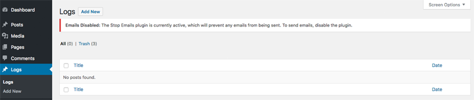

# Logging

The plugin uses, by extending, the [WP Logging Class](https://github.com/pippinsplugins/WP-Logging) to log plugin-specific events. The main class is stored in the /vendor/wp-logging folder, which we tie into this plugin with composer.

We use the default settings for this class when possible. One place we override them is the capability to see log posts. All admin users can see the Logs content type in their admin view.

Our extension to this class does a few things:

1. Allow all users who can configure this plugin to see the Logs content type in their admin view by default (there is a [developer hook](./extending-logging.md) to customize this).
2. Force a type of 'salesforce' on all logs this plugin creates.
3. Get logging-related options configured by the `admin` class.
4. Setup new log entries based on the plugin's settings, including user-defined.
5. Retrieve log entries related to this plugin.

## Settings

Use the Log Settings tab to enable logs, and also to configure what gets logged by the plugin.

If you choose to enable logging, you'll see a Logs custom content type added to WordPress. There, you'll be able to see the log entries created based on your settings.

### The Log Content Type

### Back in the Log Settings screen

If you do enable logging, you'll need to also indicate, at minimum:

1. What statuses to log
2. What triggers to log

We recommend that you allow WordPress to automatically delete old log entries. If you want to do that, you'll have to enable that option, and also fill out the settings for how often the plugin should delete and how often it should check.

These settings together mean that the plugin will check at intervals, and when it finds log entries that meet its criteria, it will delete them.
