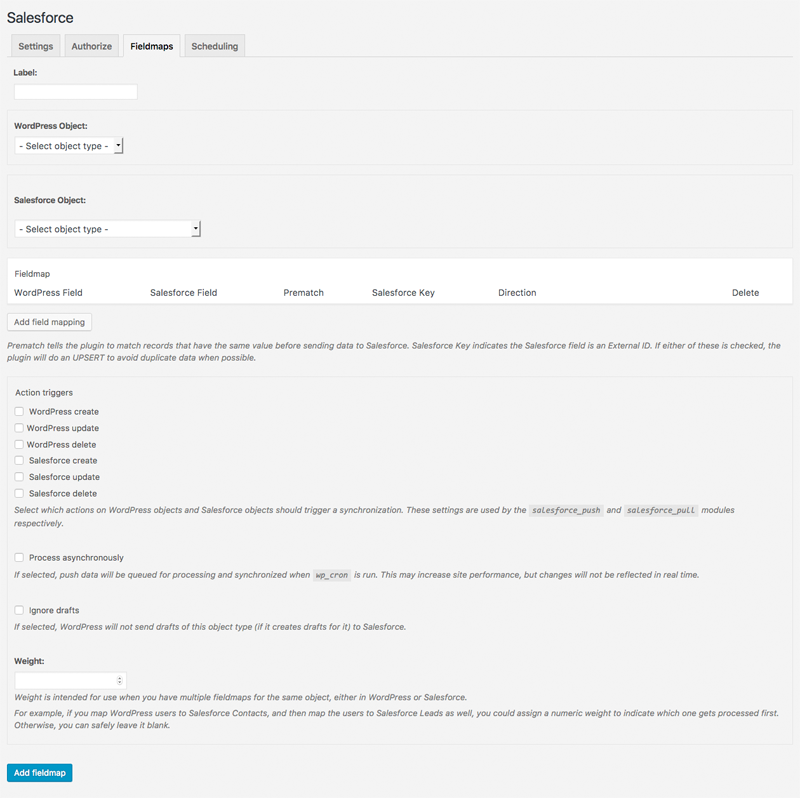

# Mapping objects

This plugin refers to mapped objects - objects that share data between WordPress and Salesforce in one direction, or both - as fieldmaps. A fieldmap is the broad category of object to object pairs. A Salesforce Contact can be a fieldmap with a WordPress user, for example.

One instance of a fieldmap - a single Salesforce Contact that shares data with a single WordPress user - is an object map. This language is shared with the [Drupal Salesforce Suite](https://github.com/thinkshout/salesforce) on which this plugin is based. Object map terminology does not appear in the plugin's admin interface, but it is how the database is structured.

Together, these mappings determine what the plugin should do when [`push`](./push.md) and [`pull`](./pull.md) events happen.

## Create/edit a fieldmap

Use the Fieldmaps tab of the plugin settings, and click Add New to create a new fieldmap. This initial load can take a while, if the plugin needs to refresh its cached Salesforce data. The screen is the same if you edit an existing fieldmap, but it will already have data.

**Note:** If your data structure in Salesforce or WordPress changes, the fieldmap list page will allow you to clear the plugin's cached data. This does not affect any cached data you may have for other plugins or functionality on your site.

The settings for a WordPress fieldmap work like this:

1. Label: you can use any text (up to 64 characters) for this. Make it unique.
2. WordPress object: the plugin gets every object it is aware of from your WordPress installation. See [below](#more-on-wordpress-object) for more.
3. Salesforce object: the plugin gets every Salesforce object it has access to. **Some objects add a dropdown field with a list of date fields to trigger "pull" actions.** See [below](#more-on-salesforce-object) for more.
4. Fieldmap: choose which fields from the WordPress object map to fields from the Salesforce object, and how the plugin should treat changes. See [below](#more-on-field-mapping) for more.
5. Action triggers: the plugin can sync data when a record is changed in WordPress and/or Salesforce.
6. Process asynchronously: whether push data will be sent to Salesforce immediately, or when `wp_cron` runs.
7. Push drafts: many WordPress objects create and save drafts while editing is happening. By default, this data is not sent to Salesforce. Checking the box causes it to be synced equally to live items.
8. Weight: if the same object is mapped multiple times, the weight will determine what happens first. This is in ascending order, so objects with higher numerical values will be mapped after objects with lower numerical values.

Several hooks exist for modifying these options, including whether a combo search/dropdown field library is used. See the [extending mapping options documentation](./extending-mapping-options.md).

### More on WordPress object

By default, this includes: user, comment, category, tag, post, any other post types built into WordPress, and any custom post types that have been added by the default WordPress conventions. You can see more about this in the [WordPress documentation](https://codex.wordpress.org/Post_Types).

The plugin also has hooks to modify what objects are included. You can read more about these in the [extending mapping options documentation](./extending-mapping-options.md#available-wordpress-objects).

### More on Salesforce object

What is contained in this list depends partly on the authenticated Salesforce user's permissions, and partly on what the plugin's settings do with objects that can't be triggered and/or updated (see the [setup documentation](./initial-setup.md) for more. This list is not currently able to be modified by developer hooks.

The date fields to trigger a pull request are how the plugin finds Salesforce records in mapped objects that have been updated since the last `wp_cron` run. For example, if you map WordPress users to Salesforce Contacts, this date field will allow the plugin to get all Contacts that have been updated since that last run.

### More on field mapping

#### WordPress fields

WordPress does not currently have a way to get all fields from an object. This plugin attempts to do this by combining the fields from an object's main table (`wp_posts`, `wp_users`, etc.) with the metadata for that object (`wp_postmeta`, `wp_usermeta`, etc.). This isn't perfect, but it gets most fields.

This gets most fields because WordPress stores metadata as key/value pairs in its database. Many plugins and themes use this method to store custom field data. Object Sync for Salesforce supports mapping these fields (many other plugins use non-standard methods, and this plugin may or may not support them).

There's a [helpful spreadsheet](https://docs.google.com/spreadsheets/d/1mSqienVYxLopTFGLPK0lGCJst2knKzXDtLQRgwjeBN8/edit#gid=3) (we are not affiliated with it, we just think it's useful) comparing various options for custom fields you can review. If the plugin you wish to use uses Meta-based Storage (listed in the spreadsheet), you should be able to use it with Object Sync for Salesforce, but how well they work together will vary. Plugins with full meta compatibility (also listed in the spreadsheet) may work the best, but you don't have to restrict yourself to those.

**Note:** this plugin cannot see meta fields before the field has at least one value in the database. For example, if you have a "testfield" on your user object, it won’t be in the fieldmap options until there is at least one user that has a value for the field.

If you load this plugin and then store data for a new meta field after this load, make sure you click the "Clear the plugin cache" link on the Fieldmaps tab.

The plugin also has a hook to modify what fields are included for an object. You can read more about this in the [extending mapping options documentation](./extending-mapping-options.md#available-wordpress-fields).

#### Salesforce fields

Salesforce fields come from the `object_describe` API method. This plugin supports syncing (at least) the following Salesforce field types:

- Picklist
- Picklist (Multi-Select)
- Date
- Date/Time
- Text
- URL

**Note:** How well these fields sync may vary if your method of storing WordPress fields differs greatly from the default meta system.

If you determine that you need to sync a field that is not yet supported, you can consider [creating an issue](https://github.com/minnpost/object-sync-for-salesforce/issues), or use the developer hooks to [extend mapping parameters](./extending-parameters.md)

#### Restricted Picklist note

If you use a restricted picklist field type in Salesforce, the Salesforce API does not currently provide a way to tell whether the picklist is configured correctly, so the plugin is unable to check for this. If you use a restricted picklist in which the expected Selected Values are not set up in Salesforce, the API will return an error.

If you encounter this issue, first try these steps in Salesforce:

1. Go to Setup
2. Customize -> Opportunities (or whatever the object type is that contains the picklist)
3. Click Record Types under Opportunities (if applicable)
4. Click the name of the desired record type (ex: Default, but don't forget to repeat the steps for every relevant record type). Clicking Edit does not work for this; only clicking the name. So the URL ends up being like this: /setup/ui/recordtypefields.jsp?id=012F00000013Gkq&type=Opportunity&setupid=OpportunityRecords
5. Scroll down to the desired picklist and click Edit
6. Move the values from Available Values to Selected Values and Save

#### Other configuration

Prematch determines whether the field should be used to match objects between Salesforce and WordPress, regardless of the direction. If it is checked, the plugin always will see objects that share a value in that pair to be matched.

A Salesforce Key is a flag in Salesforce that determines whether a field is another system's external ID. Salesforce uses this to keep data from being overwritten.

A checked Prematch (when saving data in WordPress or Salesforce) or Salesforce Key (only when saving data from WordPress to Salesforce) will cause the plugin to try to "upsert" the data to its destination. This means it checks to see if there is a match before creating a new record. You can expand how upserting works with several hooks, which are [documented](./extending-upsert.md).

Direction chooses what to do with the field's data. If you select Salesforce to WordPress, this field won't be sent to Salesforce. If you select WordPress to Salesforce, this field won't be sent to Wordpress. If you choose Sync, it will go from one system to the other whenever it changes.

Delete allows you to delete that fieldmap when you save the settings at the bottom of the page.

## Mapping individual rows

Individual object map rows - a WordPress user to a Salesforce Contact, for example - are created in several ways:

1. Manually, if the interface supports this.

    By default, this plugin can manually create object maps for users. You can see this at `https://<your site>/wp-admin/user-edit.php?user_id={userid}`. The {userid}, in this case, can be any user that isn't the currently logged in user. Don't use the {} in the actual URL.

    You will need the ID of a Salesforce object for which there is a fieldmap (as defined above) to the WordPress user, or you can "Push to Salesforce as new record" to create a new record of that mapped Salesforce object type.

2. From the Salesforce Push process.

    When a WordPress object type that is already mapped to a Salesforce object type has an event that is an active trigger (as defined above).

    - Create: if a new WordPress item is created, it will attempt to `insert` or `upsert` it into Salesforce. Upsert is used with the Prematch and Salesforce Key fields defined above. You can expand how upserting works with several hooks, which are [documented](./extending-upsert.md).
    - Update: if there is already an object map between two objects, the plugin will attempt to update the out of date item.
    - Delete: if there is already an object map between two objects, the plugin will attempt to delete the remaining item.

3. From the Salesforce Pull process.

    When a Salesforce object type that is already mapped to a WordPress object type has an event that is an active trigger (as defined above).

    - Create: if a new Salesforce item is created, it will attempt to `insert` or `upsert` it into WordPress. Upsert is used with the Prematch field defined above (the Salesforce Key field is ignored on pull operations). Developers should know that if a fieldmap uses a meta field on as a prematch value, the plugin will use WP_Query (or WP_User_Query, WP_Term_Query, etc.) to attempt to match against that value. It only uses this when it tries to match against existing records, not when it loads the value of the meta field. You can expand how upserting works with several hooks, which are [documented](./extending-upsert.md).
    - Update: if there is already an object map between two objects, the plugin will attempt to update the out of date item.
    - Delete: if there is already an object map between two objects, the plugin will attempt to delete the remaining item.

### Extending WordPress object data

As you can for the list of objects, and the fields per object, you can also extend an individual WordPress item's data. This is [documented](./extending-mapping-objects.md#wordpress-object-data).
